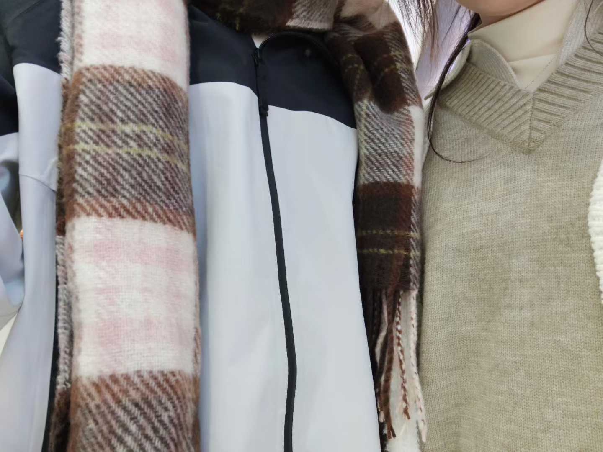

“你有心目中最伟大的发明Top10吗？” 她问。<cite>[^1]</cite>

[^1]: [@海棠](https://v.douyin.com/V7ZTV4Efyio/)

我点了点头：“有。”

“展开说说。”她似乎很感兴趣。

“Top10是围巾。”

“围巾？”

“嗯，针脚或许很细，或许很粗。一圈圈地趴在脖子上，就像挂在树上的浣熊，在那么冷的冬天里，相依偎着取暖。”

“小时候我一直觉得脖子是最令人心悸的部位，稍一受伤面对的可能就是死亡，所以我觉得围巾好棒，它在小心地维护着脆弱的生命。”

她笑，“好新奇的角度。”

“Top9呢？”

“Top9是醋。”

她似乎有些没听清：“什么？”

“那个调味品。”

“你这跨度。”她说。

“醋不像酱油和盐那样不可或缺，那样被所有人喜欢，因为它带着一股淡淡的，透着酸涩的清香。”我说，“后来我很喜欢那个味道，不管吃什么都喜欢加一点醋。”

“后来？”

“我觉得那很少年。”

“青春吗？”她说，“那Top8？”

“泡沫。”

“我们应该是在讨论发明对吧？”

“泡沫真的是个很奇妙的发明，它神秘，它璀璨，又那样轻柔容易破碎，就像梦一样。”

“可是它却比梦更加真实对吗？”她说。“我好像渐渐可以理解你的想法了。”

“Top7是镜子。”

“我觉得那是难得的真实。小时候我经常会看着镜子发呆，看着和我一模一样的影子问它为什么你就是我，它不回答我，只是和我重复着一样的话。”

“奇特的认知。”她笑。

“Top6是血液里的铁锈味。”

“跟味道过不去了是吧？”

“长大一点学化学才知道血液为什么带着一股铁锈味，但是我小时候还总是会尝试着咬破自己的嘴唇。”

“为什么？”

“就像钢铁一样，再精美的物品也会随着时间腐朽吧，那时候我觉得嘴里的铁锈味就是长大的痕迹。”

“那你现在真的长大了。”

“所以我也不会再故意去咬破嘴唇了。”

“Top5是秋天。”

“我收回之前的话，你的想法还是独具一格。”

“秋天啊，很多人都会喜欢秋天吧，大自然发明的最美好的一个季节。不再那样炎热，还离寒冷很远，风里吹的都是一股成熟的气息。”

“只不过所有的分开和遇见大都在秋天，就像落叶别辞大树，却又和土地成为新识。”

“你难道会喜欢分别？”

“还好，我不喜欢的只是没有结果，但秋天并不是。”

“Top4？”

“眼泪。”

“你现在说什么我都不会觉得奇怪了。”

“因为暴力，眼泪充满了暴力。那样暴力的悲伤快乐甚至于说委屈，那样庞大的情绪到最后只凝聚成小小的一滴，但是它所拥有的感情依旧汹涌。”

她说：“很你。”

“Top3是没有其他装饰的黄色信封。”

“这么具体？”

“我只喜欢用这一个。能写信给其他人，那个人绝对是个很亲近的人吧，所以太过浮华反而有些虚假。”我说，“信里的人依旧鲜活，可写信的人却变老了，这样的信封更容易封存过去。”

“因为它更像过去？”

“对。”

“那Top2？”她说。

“我选择投给……心脏。”

“从出生起，心脏就一直跳动，直到死亡。我一直觉得生命就是填充心脏的过程，比如慌乱，比如惊喜，它会尝试所有的频率的跳动，想要选择陪最爱的那一个长眠，然后陪到最后的还是你。”

“这算是告白吗？”

“心脏拥有的你。”

“算不算？”

“不知道。”

“Top1是晚安。”

“晚安？”

“嗯，晚安。”我重复。

“理由。”

“喜欢。”

----------------------

“闲着也是闲着，说说我身上十个优点呗。”她举着手机自拍，咖啡馆的灯光在她眼里晃了一下。<cite>[^2]</cite>

这是我们第一次来南湖散步，日子选得很妙————在连续几个月的阴雨后，终于放晴，却又不是那种会吸引人潮的炽烈晴天，天光是温和的。

我放下手机，假装很为难。

“第十，你很会挑日子。躲开了雨季，避开了人潮，连太阳都听你的话，出来得刚刚好。”

“这算什么优点？”她不解，用吸管搅动着杯里的拉花。

“像有预知天气的能力，把最好的南湖，单独留给了我们。”

“第九呢？”

“第九，是你拍照时，总会突然从后面探出的眼睛，问我‘你无聊吗？’或者‘你在想什么？’”

“我怕你觉得陪我拍照没意思嘛。”

“可你那个从取景框里看向我的眼神，比任何风景都让我心动。”

我们沿着湖边散步，她不时举起相机，又放下。

“第八，你不仅会拍风景，也会偷偷把我定格成
你相机里的‘美好瞬间’。

“被你发现啦？”

“嗯，后来我才知道，你的相册里，存着很多个
我自己都没注意到的‘我’。

走到那座咖啡馆门前的石桥，她靠在栏杆上，少
许阳光洒在她身上。

“第七，是当你有情绪或者思考时，会无意识地
撕手里的纸片，比如刚才的餐巾纸，现在已经成
了你手里的‘抽象艺术’。”

“啊，这个坏习惯…”

“可那些细碎的纸屑，像你所有说不出口的小心
事，让我想一一拾起，好好收藏。”

天色变暗，对岸的路灯一盏盏亮起，我们走进了
一家饭馆，灯光温暖。

“第六，是你总怕我吃不饱，一边念叨‘你太瘦了’，一边不停地往我碗里夹菜，堆得像座小山。”

“你要多吃点呀。”

“可你自己碗里的饭，却没动几口。”

她看着我碗里的“小山”，不好意思地笑了。

“第五，是你总怕我为你乱花钱。看到我给你买礼物，你第一反应不是惊喜，而是小声嘟囔‘又乱花钱’，然后小心翼翼地收好。可在为我挑选礼物的时候却从未有一丝犹豫。”

她捏着纸巾，小声反驳：“那不一样......”

“第四，”我的声音不自觉地放轻了些，“是你有一个只属于自己的小世界————手机备忘录里。

你总会把开心的、难过的琐碎情绪，一字一句地敲进去。

她低头喝了口水，没说话。

“那些细细碎碎的文字，像你无声的倾诉。我没说破，但从此总想多看看你的眼睛，怕你有些眼泪，只肯留给屏幕。”

“那一刻我只想，以后要让你备忘录里快乐的篇幅，远远多过那些让你湿了眼眶的瞬间”

“第三，”“是你总会把别人给你的好东西好吃的，留给我一起分享。”就像之前X带给你的榴莲月饼，像吃饭时买的两份鸡爪凉菜，像带给我的肉松小贝和蛋挞，像”

“第二，”我轻轻的抱着她，“是你总爱托着下巴，眼睛亮亮地问我：‘你到底喜欢我什么呀？’”

她的指尖在我掌心微微一动。

傍晚的风恰好吹来，发丝拂得贴在颊边。

“我喜欢的是，你向来清醒自持，却肯在我面前落泪。这种交付，比所有光鲜的特质都更让我沉溺”喜欢你坚不可摧的理智内核，也喜欢你毫无保留的脆弱时分。你是我的镇定剂，也是我唯一的，心甘情愿的失控。”

“所以…第一是什么？"

我看着她的眼睛，看着灯光在她清澈的眸子里映
出的两个小小的我。

“第一是，从湖边到饭桌，从晴天到夜晚，你让
我觉得，有一个人这样自然而然地、细水长流地
陪在身边，就是生活能给我的，最踏实、最珍贵
的浪漫。”

她低头用筷子拨弄着碗里的米粒，好久才轻声说：“你总是…油嘴滑舌。”

“没办法，”我把她爱吃的菜往她面前推了推，“谁让你的好，都藏在这些我吃不饱的碗里，和这个刚刚好的天气里。”

[^2]: [@在上小狗](https://v.douyin.com/MNj-XrQF3u8/)
