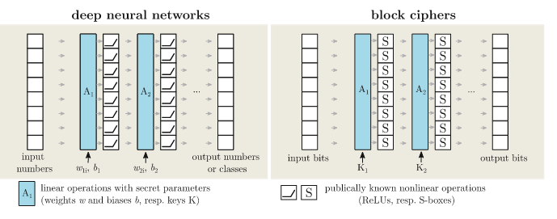
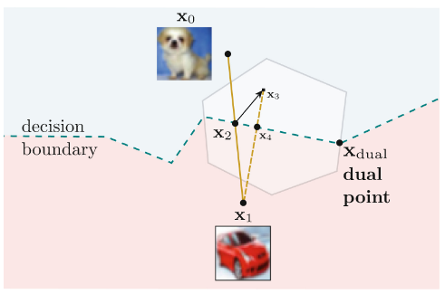
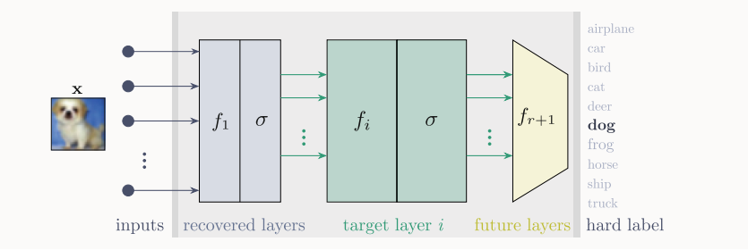
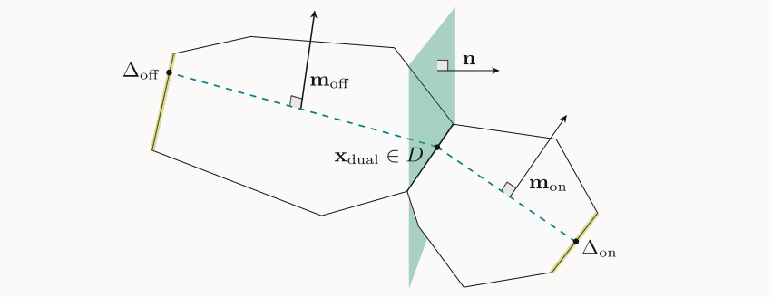

这几篇文章解决的工作其实是黑盒提取 DNN 的参数，也就是每个神经元的权重和偏置。这被类比为对分组密码的密码分析，其中，线性运算（秘密参数/密钥）和非线性运算（ReLU/S-box）相交替。

在原始输出(Raw-output)场景下，即攻击者能获取模型输出的精确数值(logits)，早期工作（Carlini et al. (Crypto’20) 和 Canales-Martínez et al. (Eurocrypt’24) 利用差分密码分析证明了基于黑盒ReLU的DNN的所有权重和偏差都可以使用查询的多项式数和计算时间来推断。然而，他们的攻击依赖于输出logits的精确数值的可用性。

而本文分析的三篇文章是研究硬标签(Hard-label)场景，攻击者只能获取最终的分类标签。这是更现实、难度也更大的场景。

| 难度等级   | 能获取的数据     |
| ----- | ------- |
| S1 | the most likely class label |
| S2 |  the most likely class label along with its probability score|
| S3 | the top-k labels and their probability scores |
| S4 |all labels and their probability scores |
| S5 |the raw output of the DNN|

# Chen et al., Asiacrypt 2024 (Xiaoyun Wang)

这是**第一篇**尝试在“硬标签”设置下实现“功能等效提取”的攻击论文。这次攻击的计算复杂度是指数级的。因此，它不具备实际应用的效率，只能在非常小的（例如最多4个神经元）、仅限二元分类器的微型网络上得到验证。

# Carlini et al., Eurocrypt 2025 (best paper)

这是该领域的**重大突破**。它首次提出了一种在“硬标签”设置下，查询数和计算时间均为多项式级的攻击方法。解决了 Chen et al. 2024 留下的指数级时间复杂度的瓶颈。

该论文的方法适用于所有基于ReLU的隐藏层，但无法提取网络的最后一个输出层，因为输出层通常没有ReLU激活函数。

## find dual points

我们知道，对于dnn每个神经元 $z_1$，都有：
$$
z_1 = w_1x_1+w_2x_2+...+w_nx_n+b_1
$$
$$
z_1=W_1x+b_1
$$

我们的目的是还原 $W_1$ 和 $b_1$。所以，一个自然的想法是，找到足够多的使 ReLU 函数等于 0 的点 $x$，构造一个线性方程组，解方程。

我们试图寻找这样一类点，同时满足：

1. 在分类的决策边界上；
2. 在某个神经元上的输出为 0.

- Step1: 随机选择$x_1$与$x_0$，通过二分法寻找到一定精度下的位于决策边界上的点$x_2$

- Step2：再找到一个位于决策边界上的点$x_4$

- Step3: 沿着$x_4−x_2$的方向行走找到突然弯曲的位置，即为 *dual point*

> [!TIP]
> ReLU网络是分段线性的，在任何一个“线性区域”内，决策边界都是笔直的。

## Geometry

所有由同一个神经元产生的dual point，都具有一个共同的几何属性：它们必然位于同一个临界超平面上。

> 假设输入空间是三维的，那么dual point（使得 $wx+b = 0$ 的点）就是两个三维向量，其一定是共面的，也就是其张成的是二维平面。

所以，我们随机挑选两个对偶点$d_1$和$d_2$判断，这两个点对应的超平面是否能够共存于一个$D-1$维超平面上。

> 也就是判断，这两个点对应的三维向量是否能够共存于一个二维平面上。

如果可以，我们就认为$d_1$和$d_2$是“一致的”，将它们放入同一个簇。通过对所有点对进行比较，最终就能把所有“共面”的点都聚集在一起。

## Signature Recovery

从第一层开始逐层恢复神经元的权重，逐层扩充prefix网络。

注意到DNN的多层结构和RELU带来的非线性性质，只有属于第一层神经元的dual points可以聚类成功。

在恢复了前k−1层之后，将dual points通过当前的prefix网络进行变换，将输出的点继续进行聚类，以获得第k层神经元的权重。

这一步只能恢复出神经元参数（权重和偏置）的一个倍数，即恢复的参数与真实参数之间相差一个任意的缩放因子 $c$。

## Sign Recovery

基本假设：定义 $Wx+b > 0$ 的区域为ON侧，另一侧为OFF侧。

一个神经元的ON/OFF状态，会影响信息在其后网络中的传播速度。

当在目标神经元的ON侧行走时，它的变化会传递给后续层，导致未来层的神经元变化得更快。

当在OFF侧行走时，它的输出被ReLU钳制在0，对未来层没有贡献，导致未来层的神经元变化得更慢。

虽然无法直接测量变化速度，但可以测量从一个对偶点出发，需要走多远的距离，才能遇到下一个由未来层神经元引起的决策边界弯曲。

对每一个神经元的对偶点聚类，多次选取对偶点进行独立的行走-测量实验，通过投票进行对符号的判断。

# Canales-Martínez et al.

这篇论文是上一篇的直接后续工作。

本文提出了一种新方法。该方法通过寻找“过渡点”（即两个类别的原始输出值相等的点），构建一个线性方程组，从而解出输出层的参数。

本文还为特定类型的网络层（收缩层，即神经元数量减少的层）提供了更高效的符号恢复技术（硬标签版本的 "freeze" 和 "SOE" 方法）。
