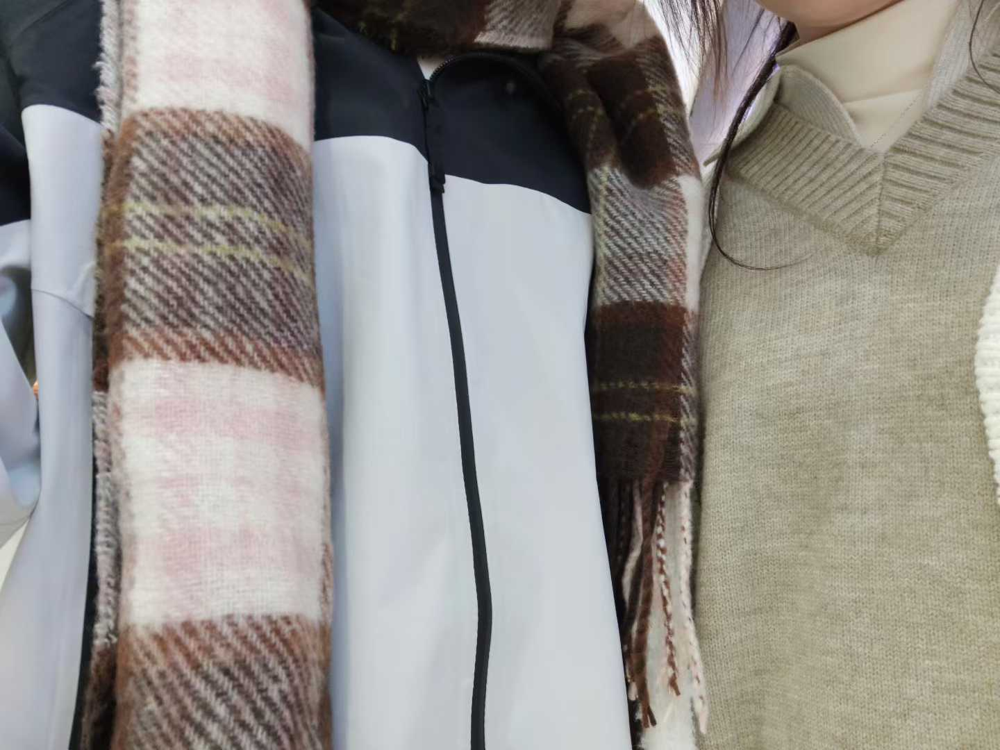

“你有心目中最伟大的发明Top10吗？” 她问。<cite>[^1]</cite>

[^1]: [@海棠](https://v.douyin.com/V7ZTV4Efyio/)

我点了点头：“有。”

“展开说说。”她似乎很感兴趣。

“Top10是围巾。”

“围巾？”

“嗯，针脚或许很细，或许很粗。一圈圈地趴在脖子上，就像挂在树上的浣熊，在那么冷的冬天里，相依偎着取暖。”

“小时候我一直觉得脖子是最令人心悸的部位，稍一受伤面对的可能就是死亡，所以我觉得围巾好棒，它在小心地维护着脆弱的生命。”

她笑，“好新奇的角度。”

“Top9呢？”

“Top9是醋。”

她似乎有些没听清：“什么？”

“那个调味品。”

“你这跨度。”她说。

“醋不像酱油和盐那样不可或缺，那样被所有人喜欢，因为它带着一股淡淡的，透着酸涩的清香。”我说，“后来我很喜欢那个味道，不管吃什么都喜欢加一点醋。”

“后来？”

“我觉得那很少年。”

“青春吗？”她说，“那Top8？”

“泡沫。”

“我们应该是在讨论发明对吧？”

“泡沫真的是个很奇妙的发明，它神秘，它璀璨，又那样轻柔容易破碎，就像梦一样。”

“可是它却比梦更加真实对吗？”她说。“我好像渐渐可以理解你的想法了。”

“Top7是镜子。”

“我觉得那是难得的真实。小时候我经常会看着镜子发呆，看着和我一模一样的影子问它为什么你就是我，它不回答我，只是和我重复着一样的话。”

“奇特的认知。”她笑。

“Top6是血液里的铁锈味。”

“跟味道过不去了是吧？”

“长大一点学化学才知道血液为什么带着一股铁锈味，但是我小时候还总是会尝试着咬破自己的嘴唇。”

“为什么？”

“就像钢铁一样，再精美的物品也会随着时间腐朽吧，那时候我觉得嘴里的铁锈味就是长大的痕迹。”

“那你现在真的长大了。”

“所以我也不会再故意去咬破嘴唇了。”

“Top5是秋天。”

“我收回之前的话，你的想法还是独具一格。”

“秋天啊，很多人都会喜欢秋天吧，大自然发明的最美好的一个季节。不再那样炎热，还离寒冷很远，风里吹的都是一股成熟的气息。”

“只不过所有的分开和遇见大都在秋天，就像落叶别辞大树，却又和土地成为新识。”

“你难道会喜欢分别？”

“还好，我不喜欢的只是没有结果，但秋天并不是。”

“Top4？”

“眼泪。”

“你现在说什么我都不会觉得奇怪了。”

“因为暴力，眼泪充满了暴力。那样暴力的悲伤快乐甚至于说委屈，那样庞大的情绪到最后只凝聚成小小的一滴，但是它所拥有的感情依旧汹涌。”

她说：“很你。”

“Top3是没有其他装饰的黄色信封。”

“这么具体？”

“我只喜欢用这一个。能写信给其他人，那个人绝对是个很亲近的人吧，所以太过浮华反而有些虚假。”我说，“信里的人依旧鲜活，可写信的人却变老了，这样的信封更容易封存过去。”

“因为它更像过去？”

“对。”

“那Top2？”她说。

“我选择投给……心脏。”

“从出生起，心脏就一直跳动，直到死亡。我一直觉得生命就是填充心脏的过程，比如慌乱，比如惊喜，它会尝试所有的频率的跳动，想要选择陪最爱的那一个长眠，然后陪到最后的还是你。”

“这算是告白吗？”

“心脏拥有的你。”

“算不算？”

“不知道。”

“Top1是晚安。”

“晚安？”

“嗯，晚安。”我重复。

“理由。”

“喜欢。”
