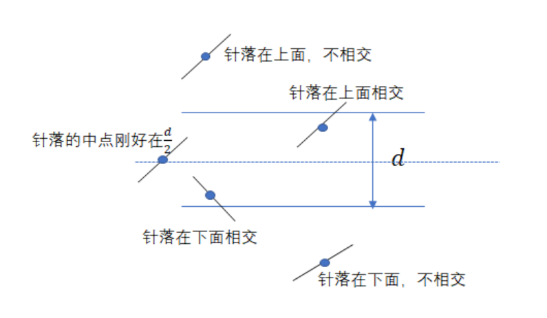
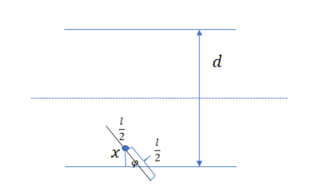

## 古典概型[^1]

[^1]: [凝望，划过星空的博客](http://blog.csdn.net/weixin_44586473/category_9749316.html)

古典概型必须满足下面两个条件：

1. 每个事件发生的概率都是相同的；

2. 随机试验的结果是有限的。

**Problem.** 袋子里面有 $a$ 个黄球和 $b$ 个白球，从中接连任意抽取 $k$ 个球，且每一次抽的球不放回。求第 $k$ 次抽到黄球的概率。

*Solution I.*

这是一个古典概型。从 $a+b$ 个球中连续抽取 $k$ 个，基本事件数为：$A_{a+b}^{k}$

第 $k$ 次抽到黄球的所有可能为：$C_{a}^{1}A_{a+b-1}^{k-1}$

$\therefore$ 第 $k$ 次抽到黄球的概率 $P=\frac{C_{a}^{1}A_{a+b-1}^{k-1}}{A_{a+b}^{k}}=\frac{a}{a+b}\ \ \ \square$

*Solution II.*

这个问题本质上相当于把所有的小球随机地排成一排，问第 $k$ 个小球是黄色或者白色的概率。

于是，我们得到结论：第 $k$ 次抽到黄球的概率和第 $1$ 次抽到黄球的概率相同。$\square$

$\text{done.}$

## 几何概型[^2]

[^2]: [26 个比较概率大小的问题-Matrix67](https://matrix67.com/blog/archives/6665)

**Problem.** 在一根木棒上随机选择两个点，并在这两个点处下刀，把木棒砍成三段。下面哪种情况的可能性更大一些？

- A. 这三段木棒能拼成一个三角形
- B. 这三段木棒不能拼成一个三角形
- C. 上述两种情况的出现概率相同

*Solution.*

我们可以证明，这三段木棒能拼成三角形的概率是 1/4 。

不妨把这根木棒的长度设为 1 ，两个分割点的位置分别记作 x 、 y ，则 x 和 y 都是 0 到 1 之间的随机数。

那么，所有可能的 (x, y) 组合就对应了正方形 (0, 1) × (0, 1) 内的所有点。三段木棒能拼成三角形，当且仅当 (x, y) 落在了阴影部分。$\square$

> Lemma: 通常我们说“任意两边之和大于第三边”，但在总长度固定的概率问题中，有一个更简单直观的等价条件：三段木棒中，任意一段的长度都必须小于总长度的一半。

著名的 Buffon 投针问题，标准解法之一也用到了这种模型。

**Problem.** 现在有一个宽度为 $d$ 的平面和一根长度为 $l(l<d)$ 的针。现在把这个针随便扔，测量针的中心点与跟他较近的那一边的距离，记为 $x$，再记录针与相交边的夹角 $\phi$。问针与两条平行线相交的概率？

*Solution.*

我们下面针对“针和线边缘相交的情况”分析一下：

我们很容易知道，夹角的范围就是 $0<\phi<\pi$，$x$ 的范围是 $0<x<\frac{d}{2}$. 其构成的平面就是样本空间。

:::gallery

:::

要使得针与边缘相交，我们还需要有：

$$
\frac{x}{sin\phi}\leq \frac{l}{2}
$$

最终通过面积之比，我们可以计算出 $P=\frac{2l}{\pi d}$. $\square$

> 这就是蒙特卡洛方法，通过统计试验去计算某些未知数的方法。

高中数学课本把这种解决概率问题的模型叫做“几何概型”。

说到几何概型，最经典的可能要算下面这个例题。

**Problem.** A 、 B 两人约定好晚上 6 点到 7 点之间在公园门口见面。每个人都会从这段时间当中随机挑选一个时间，并在这个时间到达公园门口。每个人都只愿意等待 15 分钟，也就是说，如果 15 分钟之后没有看见对方，那么就立即离开。那么，两人最终能见面的概率有多大？

*Solution.*

我们考虑两种情况：1 甲先到了，等乙15分钟；2 乙先到了，等甲15分钟，即

$$
|x-y|\leq 15
$$

如图所示。

答案是 7/16 。$\square$

$\text{done.}$

## 条件概率
